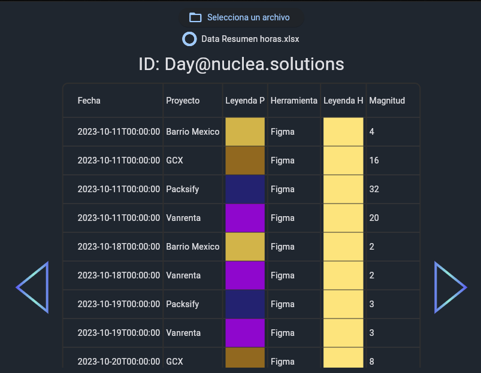

# Reto-Nuclea-Solutions
**Requerimentos:**
* Flet, Pandas, openpyxl, typing en sus versiones indicadas

**Como Ejecutar:**
* Inicia tu codespace
* Ingresa el comando *python -m venv ./*
* A continuacion activa el entorno virtual con: *source bin/activate*
* Instala todos los requerimentos con el comando *pip install -r requeriments.txt*
* En la terminal, ejecuta el siguiente comando:  *flet run -w App.py*

**Funcionamiento**
- Selecciona el arrchivo a leer.
- Al momento de subir el archivo este sera leido y ordenado
- Se mostrara una tabla con la fecha, proyecto, y herramienta con la que trabajo
- Se mostrara una leyenda donde se le asignara un color aleatorio a cada herramienta y proyecto.

**CAPTURAS**

